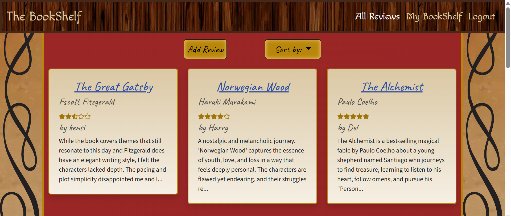
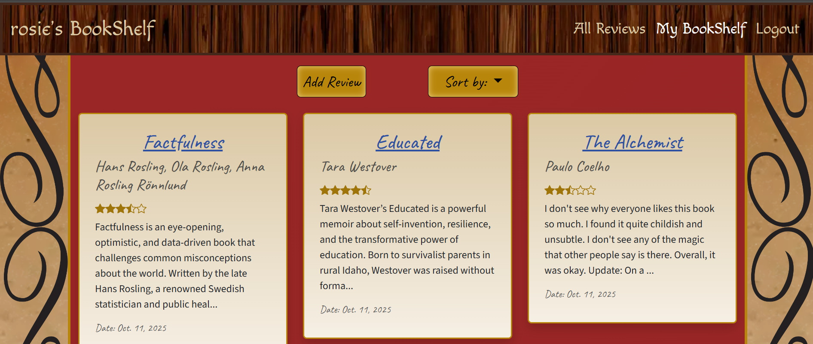
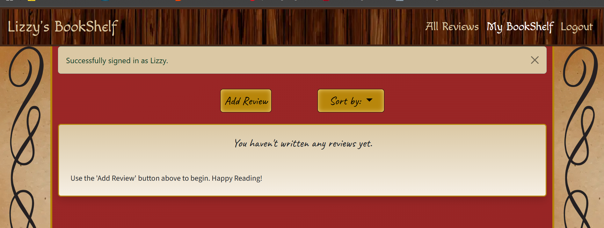
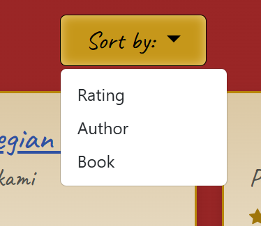
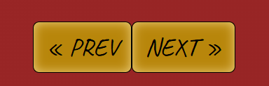
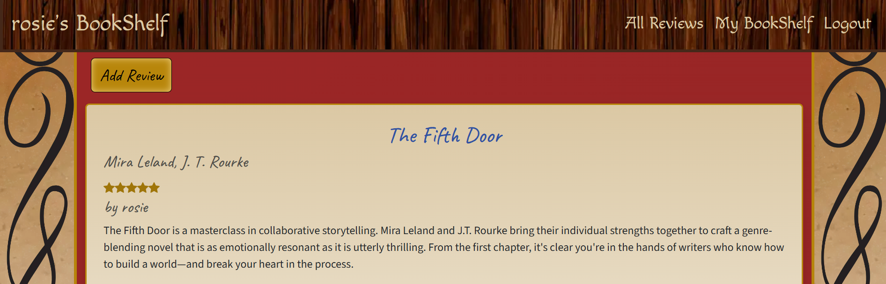
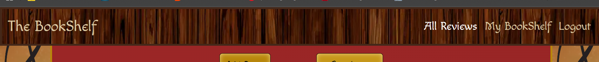
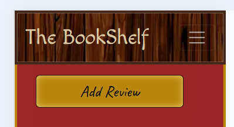
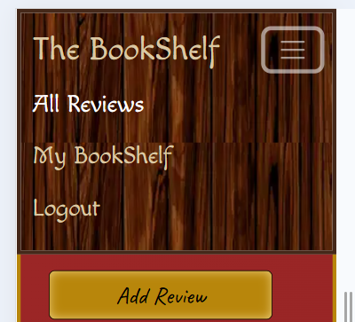
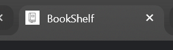

# BookShelf

## Introduction

BookShelf is a reading log app for book lovers who want to keep track of their reading. BookShelf helps you record, rate, and review your favourite books. 

**Personalised Reviews:** Log the books you’ve read, write detailed reviews, and rate them.  

**Edit and Manage:** Update or delete your reviews as your thoughts evolve, or on subsequent reads.  

**Discover New Reads:** Browse the homepage to see reviews from other readers to see what they thought of a book, or discover new recommendations.  

**Sort Easily:** Sort reviews by rating, book, or author, to quickly find what you’re looking for.

## Table of Contents

## Table of Contents

- [Introduction](#introduction)
- [Deployed Site](#deployed-site)
- [Features](#features)
  - [Main Pages](#main-pages)
  - [CRUD Functionality](#crud-functionality)
  - [Login/Signup](#login-signup)
- [Future Features](#future-features)
- [Database Design and ERD](#database-design-and-erd)
- [UX](#ux)
  - [Design](#design)
    - [Colour Scheme](#colour-scheme)
    - [Fonts](#fonts)
    - [Wireframes](#wireframes)
    - [Responsivity](#responsivity)
  - [User Stories](#user-stories)
  - [Agile](#agile)
- [Tech Used](#tech-used)
- [Testing](#testing)
  - [Accessibility](#accessibility)
  - [Lighthouse](#lighthouse)
  - [Manual Tests](#manual-tests)
  - [Unit Tests](#unit-tests)
  - [Validation](#validation)
- [AI Use](#ai-use)
  - [Debugging](#debugging)
  - [UX and Performance](#ux-and-performance)
  - [Code Generation](#code-generation)
  - [AI Influence on Workflow](#ai-influence-on-workflow)
- [Deployment](#deployment)
- [Credits](#credits)

## Deployed site

The site was deployed on Heroku:
[BookShelf](https://book-shelf-app-cdf881ab4579.herokuapp.com/)

## Features

### Main Pages

The site has three main pages, as well as pages for adding or editing reviews, and sign up, login, and log out pages. 

The homepage contains all the reviews on the site. These reviews contain usernames so you can see who posted which reviews. 

The user review page (My BookShelf) contains only the reviews for the user, so they can easily access and track their own reading. These reviews contain a date, so they can see what they read and when. If they haven't submitted any reviews yet, a message is shown to make this clear.  The user's username is shown in the header.

These pages allow sorting by rating, book, or author via a dropdown so users can see the highest or lowest rated books, or can search for their favourite author or book.

These pages are paginated, by 12 reviews so there is a managable amount of content shown. Pages can be changed through buttons at the bottom, and sorting is maintained throughout.

The review detail page (linked through the book title) shows the whole content of a review so they can read what was said in more detail. 

If the user is viewing a review that they submitted, their username is also shown in the header.

Naviagtion is through the header, which shows 'login' and 'sign up' if the user is not logged in. If they are, it shows 'log out', and a link to their reviews page. 

On mobile, the navigation collapses into a toggle.

There is a favicon of a book for the site.

### CRUD Functionaliy

The form to add a review is accessed by a button, visible to logged in users. 

The form contains validation, ensuring it is filled out correctly.
If they have not filled out the form correctly, a message is shown. If they try to post more than one review for a book, it is disallowed and a message is shown.

Users can edit or delete their own reviews through buttons below the review detail. 

A modal is created when a user tries to delete their review, asking for confirmation.

Users are notified when they they post a new review, edit a review, or delete a review.

If users attempt to visit a page or complete an action that they are not allowed to, they are redirected and a message is shown:

-- Visit My BookShelf when not logged in

-- Edit a review other than your own

-- Delete a review other than your own

### Login/Signup

There are sign up, log in, and log out pages.

User's are notified for these actions.

When a user signs up or logs in, they are redirected to their user review page.

Superusers can access the admin page through the url '/admin', when they are logged in. Here they can edit or delete delete reviews, books, or users.

## Future Features

Reading stats: Users have a section on their bookshelves for how many books reviewed last month, their highest rated and lowest rated books or authors, the month they read the most books. This would keep users motivated to read and review as they can see their stats clearly and want to improve them.

Book specific reviews: A page for all reviews for a certain book so users can see what others thought of the book.

Author pages: A bio page for each auther, with links to the reviews of their books.

Book covers on reviews: Each review has an image with it. Either fectch book covers via an API or allow users to upload their own.

Autocomplete: Authocomplete on book and author fields on the form with previously entered information. This would reduce dupilcates through misspelling, and improve the user experience as they wouldn't have to type everything out, or if they forgot a name.

Search function: Users can search for reviews about a book or author.

Other improvements:
-- Change favicon to something simpler so it is more easily seen.
-- Add extra validation to books/authors.

## Database Design and ERD

<!-- Add ERD -->

My database uses Django's ORM with 3 custom models: Author, Book, and Review. It also linked to the User model, which is provided by Django.  
The Review model has a foreign key to User, which denotes which user posted which review. It also has a foreign key to Book, which has a many-to-many relationship to Author, allowing there to be multiple authors for one book. 

I did consider simply having a single Review model with a foreign key to User, where the book and author fields are simple CharFields. This probably would have been sufficient for my project's MVP. However, I decided against this for several reasons:  

-- Real-world modeling: The current database structure mimics the realtionships between these objects in the real world.  

--Scalability:  You can more easily fetch all books by an author, or reviews for a book. This means you could implement future features such as author bios linked to their books, pages for all reviews for a certain book, or most liked books. On the one custom model design, this wouldn't be possible.  

--Flexibility: You can add more fields to the book and author models such as biography to Author, or genre to Book, without having to modify the Review model.  

--Enforcing Constraints: The unique constraint where each user can only have one review for a book is more easily enforced with a foreign key to Book. 

--Avoid Redundancy: With no Author or Book model, each review would store the book and author, leading to many duplicates of the same book and author data.  
However, my project does not completely ensure there is no duplication as I decided to render the author and book fields on the add_review form as CharFields, not dropdowns (the Django defualt for foreign keys and ManytoMany fields). This decision was made becuase I believe it to be a poor user experience to have to scroll through a long list of books or authors to find the one you want, and then discover no one has added it yet.  

I have added some data validation and normalisation within the form and view to reduce the risk of duplicate entries for authors and books. These checks ensure that identical entries are not created when the same name is entered, regardless of case used or whitespace. However, it is not sufficient to prevent duplicate objects due to misspelling a book title or author's name. I would like to add more validation in future to reduce this risk, such as an autocomplete feature or stricter backend validation. For now, I consider it an acceptable trade off between data consistency and user experience.

I also considered using an API to fetch book and author details. Although this would handle the validation for me, I decided against this as part of the purpose of this project was to further my understanding of database management and input validation within Django. 

## UX 
### Design

Overall, for the design I wanted to evoke an old journal, or library. My design choices were made with this in mind.

#### Colour Scheme

| Colour      | Hex Code    |
| ----------- | ----------- |
| Red Leather | #9b2626   |
| Parchment   | #dbc8a4   |
| Bronze/Gold | #b8860b   |
| Ink Blue    | #2f51a2   |
| Wood Brown  | #452819   |

The header/navigation has a dark wood effect image as the background, evoking a book shelf.

The centre section has a red background, with a slight gradient, mimicking the red leather you might find on an old book. 

Down the side, the site has decorative scrollwork on a parchment background - like you might find on old illustrated books.

The review cards have a parchment (off-white) colour to them, with a slight gradient to make it feel more organic. 

The titles for each review are in a dark blue to mimic fountain pen ink. 

Accents, such as buttons or borders, are in a bronze/gold colour such as you might find on journal clasps.

#### Fonts

| Section     | Font          |
| ----------- | ------------- |
| Navbar      | Macondo       |
| Headers     | Caveat        |
| Content     | Source Sans 3 |

The header/navigation font is Macondo - a stylised cal'igraphy font, used because it looks like an old bokshop sign. It is only used for larger text, so legibility isn't a concern.

Review headers are Caveat - mimics handwriting as you might find in a journal. This style might be harder to read in large blocks of text, but it is only used for shorter content such as book titles.

Review bodies are in Source Sans 3 - sans serif and uncomplicated. As the content of the reviews are longer sections of text, a more legible and easy to read font is used for accessibility.  
I considered using a monospaced or typewriter style font but, on testing, this was too distracting and difficult to read in large sections. 

#### Wireframes

### Responsivity

The site is fully responsive for mobile, tablet, and desktop. 

### User stories

My user stories focused on CRUD functionality, ease of use, account management, and accessibility.  

I used MoSCoW prioritisation and aimed for 60-70% must-have stories, in line with best practices.

I haven't detailed my won't-haves here, but some I considered are in the Future Features section above.

Complete User Stories

| User Story | Priorisation |
|------------|--------------|
| As a new user, I want to register an account so I can create and manage my own book reviews. | Must-have |
| As a user, I want to be able to log in to see my personal book reviews so I can see and add to my reading log. | Must-have |
| As a user, I want to have clear indication that I am logged in so I know I can access/edit my reviews. | Must-have |
| As a user, I want to see an error message and/or be redirected when I try to access a page without permission, so I understand what went wrong and how to fix it. | Must-have |
| As a user, I want to be able to see book reviews by others so I can see what they think of books I've read. | Must-have |
| As a user, I want to view a list of my book reviews with titles and ratings so I can quickly scan what I’ve read and how I felt about it. | Must-have |
| As a user, I want to be able to view a review in detail, so I can remember what I thought about a book when I read it. | Must-have |
| As a user, I want to be able to add a new book review so I can record my thoughts and opinions on what I’ve read. | Must-have |
| As a user, I want to be able to edit a review I’ve submitted so I can update or change my thoughts over time. | Must-have |
| As a user, I want to be able to delete a review so I can remove mistakes or books I no longer want in my history. | Must-have |
| As a user, I want to see clear confirmation messages after adding, editing, or deleting a review so I know the action was successful. | Must-have |
| As a user with accessibility needs, I want to be able to access the site fully so I can record my reading. | Must-have |
| As a user, I want to be able to easily navigate the site so I can quickly get to the actions I want. | Must-have |
| As a mobile/desktop user, I want to be able to visit the site on all platforms so I can view and update my reading logs. | Must-have |
| As a user, I want to be able to rate my books easily, so I can quickly see what I thought without having to read the whole review. | Should-have |
| As a user, I want to see a confirmation message when I log in or log out, so I know the action was successful. | Should-have |
| As a new account holder, I want to see a clear message on my dashboard when it's empty so I know something hasn't gone wrong. | Should-have |
| As a visual user, I want to able to see book ratings in a star format, so I can easily see what rating was given. | Should-have |
| As a user, I want to be able to sort reviews by rating so I can see which books I most enjoyed, or that others enjoyed. | Should-have |
| As a user, I want to be able to sort reviews by author or book so I can find what I or other think of their work. | Should-have |
| As a user, I want to filter reviews (e.g. by author or rating) so I can find specific types of reviews. | Could-have |
| As busy user, I want to be able to save a review as a draft so I can come back and finish it later. | Could-have |
| As a visual user, I want to see the book covers associated with reviews so I can easily remember the book they're referencing. | Could-have |

### Agile

I took an agile approach to this project. I based my development tasks off user stories, and worked towards my MVP (must-haves). After completing the MVP, I revisited the should-have features and selected those that I felt would bring the most user value whilst being reasonable to achieve in the remaining time. The deadline did not allow for me to reach implementation of my could-haves in this iteration.

To generate my user stories, I had several epics which I then used as my milestones for the project, allowing me to track my progress towards the MVP functionality. My epics included 'CRUD Functionality', 'User Authentication', and 'Front-End' (including accessibility, ease of use, responsivity etc).

I used a Github Kanban Project Board to track and manage tasks throughout development. I had 3 columns - todo, in progress, and done. This way I could easily see what I had left to work on, and prioritise my tasks for the day.

[Github Project Board](https://github.com/users/RosieTrainor/projects/9)  

I also added bugs to my Kanban Board as I found them. This helped workflow since I could then track these and not have to fix them immediately or worry about forgetting to do so. I could instead come back when it was convientient, and not disrupt the flow of the project.

In reflection, this workflow worked well to keep me organised and on track.  
In future, I plan to weight my user stories by ease of implementation as well as importance, as some were much more work than others. This would help me track my progress more accurately and allow me to more easily scope the tasks for each day.

## Tech used 

Python, JavaScript, HTML, CSS: Languages Used  
[Git](https://git-scm.com/), [Github](https://github.com/): Version Control  
[Django](https://www.djangoproject.com/): Full-stack Framework  
[Django-Allauth](https://docs.allauth.org/en/latest/): User Account Management  
[Heroku](https://www.heroku.com/): Deployment  
[Bootstrap](https://getbootstrap.com/): Front-End Framework  
[PostgreSQL](https://www.postgresql.org/): Database  
 

## Testing

### Accessibility

#### Colour Contrast

All the colours used on the site were tested against WCAG colour contrast standards, to ensure each component stood out against the background for visually impaired users.

All compoments meet at least WCAG AA standards, with many meeting AAA.

The navigation section has a wood image as its background, with many colours within it. To test this I extracted the lightest colour found in the background and tested it against the font colour. It met WCAG for large text. All other colours in the image met WCAG AAA for both large and small text. Since the lightest colour in the image is not at all prevalent, I was happy with this result.

As a result of this test, I did have to darken the stars for the ratings slightly (to #9F7509), as the accent colour that's used elsewhere did not contrast well enough with the parchment of the review cards. With the darkened colour, the result was WCAG AA for icons.

#### Navigation and Screen Readers

You can tab through the site in a logical order.

The navigation is consistent throughout.

All form fields have labels, and buttons have clear descriptions.

Semantic HTML was used and headings are in a logical order.

Messages have a role="alert" set for screenreaders.

### Lighthouse

I tested the main pages of my site: Homepage (while logged in, or logged out), User Review List, Add Review, Edit Review.

Accessibility: 100
SEO: 100
Best Practices: 100

Performance: 93-97 (varied between pages)  
Initially, my performance score was around 80. I made several changes: preloading images and css files, compressing images, using locally stored icons rather than Bootstrap Icons CDN, and optomising database queries, which then increased the scores.

<!-- images -->

### Manual Tests

Manual Test Log

| User Story | Expected Outcome | Actual Outcome |
|------------|------------------|----------------|
| As a new user, I want to register an account so I can create and manage my own book reviews. | User can register new account | Pass  | 
| As a user, I want to be able to log in to see my personal book reviews so I can see and add to my reading log. | User can log in | Pass |
| As a user, I want to have clear indication that I am logged in so I know I can access/edit my reviews. | 'log out', 'My BookShelf' in header | Pass |
| As a user, I want to see an error message and/or be redirected when I try to access a page without permission, so I understand what went wrong and how to fix it. | User redirected with message | Pass |
| As a user, I want to be able to see book reviews by others so I can see what they think of books I've read. | All Reviews page | Pass |
| As a user, I want to view a list of my book reviews with titles and ratings so I can quickly scan what I’ve read and how I felt about it. | List of user's reviews on 'My BookShelf' | Pass |
| As a user, I want to be able to view a review in detail, so I can remember what I thought about a book and when I read it. | Link to review detail, review is shown | Pass |
| As a user, I want to be able to add a new book review so I can record my thoughts and opinions on what I’ve read. | Add button obvious, review is added to database and page | Pass |
| As a user, I want to be able to edit a review I’ve submitted so I can update or change my thoughts over time. | Edit button, review is updated after editing | Pass |
| As a user, I want to be able to delete a review so I can remove mistakes or books I no longer want in my history. | Review deleted from database and page | Pass |
| As a user, I want to see clear confirmation messages after adding, editing, or deleting a review so I know the action was successful. | Messages shown for actions | Pass |
| As a user with accessibility needs, I want to be able to access the site fully so I can record my reading. | Tab through site, labels for screenreaders, colour contrast good | Pass (additional testing in accessibilty section) |
| As a user, I want to be able to easily navigate the site so I can quickly get to the actions I want. | Navbar and buttons clearly labelled, all links work | Pass |
| As a mobile/desktop user, I want to be able to visit the site on all platforms so I can view and update my reading logs. | Site functional and easy to use on mobile/tablet/desktop | Pass |
| As a user, I want to be able to rate my books easily, so I can quickly see what I thought without having to read the whole review. | Rating via dropdown on form, shown on reviews | Pass |
| As a user, I want to see a confirmation message when I log in or log out, so I know the action was successful. | Messages shown when log in/out | Pass |
| As a new account holder, I want to see a clear message on my dashboard when it's empty so I know something hasn't gone wrong. | Message shown when no user reviews | Pass |
| As a visual user, I want to able to see book ratings in a star format, so I can easily see what rating was given. | Ratings rendered as stars including half stars | Pass |
| As a user, I want to be able to sort reviews by rating so I can see which books I most enjoyed, or that others enjoyed. | Reviews are sorted by rating | Pass |
| As a user, I want to be able to sort reviews by author or book so I can find what I or other think of their work. | Reviews are sorted by author, or book | Pass |
| As a user, I want to filter reviews (e.g. by author or rating) so I can find specific types of reviews. | Not Implemented | - |
| As busy user, I want to be able to save a review as a draft so I can come back and finish it later. | Not Implemented | - |
| As a visual user, I want to see the book covers associated with reviews so I can easily remember the book they're referencing. | Not Implemented | - |

The site was a also tested for functionality on Microsoft Edge, Safari, and Chrome. It worked as expected on these browsers.

### Unit Tests

I implemented unit tests for my add_review form because manually testing all possible cases would be challenging. It was especially important to ensure the form functioned correctly and handled edge cases effectively before I began to add data. 

These tests covered:

#### Data Management:  
When a user posts a review:
- the author is associated with the book
- the book is associated with the review
- no book or author duplicate objects are created if the author or book already exists
- the author is not amended if the book has the same title as an existing book but a different author (allowing multiple books named e.g. "The Secret" by different authors)
- case insensitivity and/or whitespace does not create duplicate objects
- the reviewer can only have one review per book

#### Form Validation: 
The form ensures:
- rating is required
- content is required
- book title is required
- author is required, with valid input being either a single author, or multiple authors split by commas
 

### Validation

#### CSS

I used the W3C CSS Validator and found no errors.  
<!-- image -->

#### HTML

I used the W3C HTML Validator.  
Most pages had no errors, but my add_review page had an error where a form element was within a p element which is invalid HTML. I changed the p to a div and this resolved the issue.
<!-- image -->

There are some errors generated from Django-allauth's form field element template, within the signup.html page.
Although I had customised the signup.html template, the errors originate from django-allauth's elements HTML code, not any written by me. As this issue comes from third-party code, addressing it falls outside the scope of this project.

Allauth Template Errors

&lt;p&gt;↩
    &lt;label for=&quot;id_password1&quot;&gt;Password:&lt;/label&gt;↩
    &lt;input type=&quot;password&quot; name=&quot;password1&quot; placeholder=&quot;Password&quot; autocomplete=&quot;new-password&quot; required aria-describedby=&quot;id_password1_helptext&quot; id=&quot;id_password1&quot;&gt;↩
    ↩
      &lt;span class=&quot;helptext&quot; id=&quot;id_password1_helptext&quot;&gt;&lt;ul&gt;&lt;li&gt;Your password can’t be too similar to your other personal information.&lt;/li&gt;&lt;li&gt;Your password must contain at least 8 characters.&lt;/li&gt;&lt;li&gt;Your password can’t be a commonly used password.&lt;/li&gt;&lt;li&gt;Your password can’t be entirely numeric.&lt;/li&gt;&lt;/ul&gt;&lt;/span&gt;↩
    ↩
    ↩
  &lt;/p&gt;

Error: End tag p implied, but there were open elements.

Error: Unclosed element span.

Error: Stray end tag span.

Error: No p element in scope but a p end tag seen.

#### JavaScript

I used the JSHint Validator. I had an error for a missing semicolon, which I fixed. The linter gave me warnings for using "const" and template literals which are not supported in earlier (pre-ES6) versions of JavaScript. However, modern browsers fully support ES6 and it is best practice to use this, so I configured the linter to allow ES6 this removed the warnings. 

Additionally, I had a warning for an undeclared variable ('bootstrap', referring to my Bootstrap modal). However, the Bootstrap JavaScript is correctly loaded in my base HTML template, and no errors appear in the browser console on pages using the modal. This warning is due to the static analysis of script.js in isolation and not an issue with the code or the project as a whole.
<!-- image -->

#### Python

I used Code Institute's Python Linter. I had some warnings for whitespace within blank lines, which I then fixed.

<!-- image -->

## Deployment

This project was deployed on Heroku, pulling from Github.

#### To enable deployement:  

Ensure all sensitive information, such as your SECRET_KEY and DATABASE_URL, are stored as environment variables and not visible in your project code. Set DEBUG in settings.py to 'False'.

Install requirements.txt - the important installations for deployment are gunicorn for serving the application, and whitenoise for handling static files.  

Add a Procfile at the root of your project, with the content: "web: gunicorn {project_name}.wsgi".  
Add a .python-version file specifying your version of python.

Add '.herokuapp.com' to ALLOWED_HOSTS within your project's settings.py.  
Add 'https://*.herokuapp.com' to CSRF_TRUSTED_ORIGINS within your project's settings.  

Set a STATIC_ROOT in your settings.py to show where the static files are located.  
Run 'python manage.py collectstatic' to collect the static files to a staticfiles directory for deployment.   

Commit and push your code to Github, on the branch you want to deploy from.   

#### To deploy:
Navigate to your Heroku dashboard.  
Create a new Heroku app.  
Select the region closest to you for deployment. 

Generate a secret key to be used with Heroku. This should be a different key to the one used in your project code.    
Go to the settings tab and select Config Vars.  
Add these two keys:  
-- DATABASE_URL : {your_project's_database_url}  
-- SECRET_KEY : {your_secret_key}  

Navigate to the deploy tab.  
Connect to Github and select your project repository.  
Select 'Manual Deploy' and choose the branch you want to deploy from.  
Click 'Deploy Branch'.    

## AI use

### Debugging 

AI (ChatGPT, GitHub Copilot) was used for debugging throughout this project. I found it most useful when the issue was something easily overlooked, especially within large sections of code. 

Examples of AI debugging:
-- My homepage layout was incorrect, Copilot helped me find the issue: a div was nested incorrectly. 
-- My user_review_list template wasn't rendering. Copliot highlighted this issue: I had forgotten to add a trailing slash to a url. 
-- My sorting functions weren't preserved if you navigated to the next page.Copilot suggested adding the necessary code to the pagination buttons to ensure the sorting functionality was maintained. 
-- You cannot perform operations on floats within django's template logic, which I needed to do for rendering my ratings as stars. Copilot suggeted adding a custom template tag to work around this.

However, AI has limitations. In my final example above, Copilot at first suggested using the Django template filters 'add' and 'floatformat'. However, after reading the documentation for these filters, they would not work in the way Copilot suggested. I had to tell Copilot this and ask for other suggestions. I then checked these suggestions against online resources and Django documentation to use the most suitable one. 

In another case, Copilot told me the incorrect file path for overriding allauth templates. I checked the allauth documentation and example projects to ensure I had the correct path.

I find that AI is best used for simpler errors such as syntax errors, pointing our errors in logic, and for suggestions on where to look for answers when you are stuck. However, you should always double check any suggestions using online resources and official documentation, and ensure that what AI is telling you is both correct and suitable for your project.

### UX and Performance

I used ChatGPT in the design of my site. I gave it the general idea of what I wanted it to look like and asked for some colour hex codes that would fit this e.g. a parchment colour for the review cards. This saved me time in picking the colour scheme. I took ChatGPT's suggestions and use online colour tools to find lighter or darker shades if necessary, rather than trying to pick the colours manually. 

ChatGPT was also used to refine my user stories where I was unsure how to phrase them.

Copilot aided me with improving the site's performance. As I was only using three icons from bootstrap icons, I stored these locally instead of using Bootstrap Icons CDN. Copilot helped take me through linking to SVG's within a templatetag, ensuring they were correctly referenced.

I also asked Copilot for further performance enhancements I could implement. It suggested using prefetch_realted and select_related on my database queries to avoid repeated queries.

### Code Generation

Given AI's limitations and the fact that this was an educational project, I mostly avoided using AI for code generation during this project. I would code the section myself, and use Copilot to check my work to see if there's anything I hadn't considered. I found this very useful. 

The exceptions to this were for styling and unit testing. If I couldn't remember the style rule or bootstrap class for something, I would ask Copilot. This was quicker than searching online for the same thing.

With unit testing, I used AI to generate tests for my add_review form as this was much quicker than writing them out myself. However, whilst some of these tests worked as expected, many required significant amendments because they did not test the correct functionality. 

For example, I wanted to test that creating a second review for an existing book object would not create a duplicate book object, but associate the review with the existing object. The AI generated test for this created a second review form, but did not save it to the database. This meant that whilst test passed  (a second book object was not created) it was not because the second review was associated with the existing book, but because the second review was never saved. 

Additionally, the AI failed to anticipate that some logic for associating books and authors existed within the add_review view, not form. This meant that the tests generated were giving erroneous results. To fix this I added a utility function to my tests to simulate the view logic and ensure the data was processed correctly. 

Overall, using AI to generate these tests did save time. However, they had to be carefully analysed and amended to ensure the tests fulfilled their function. 

### AI Influence on Workflow 

Using AI in this project sped up development:

Less interuptions to workflow: 
-- Rather than having to search for syntax errors in large code sections, I could highlight and ask copilot. 
-- Rather than searching the internet for style rules, bootstrap classes, or Django template filters, I could ask Copilot. 

Faster access to resources:
-- If I couldn't find a section of documentation, or online resource that I needed, I would ask Copilot to link me to the correct page. This was helpful as sometimes I was unsure where to find the answers within the documentation, or what exactly to google. I could instead just explain the problem to Copilot and it would show me where to find answers. This wasn't foolproof as Copilot would sometimes link to outdated documentation, but it sped things up. 

Anticipating bugs:
-- If I was unsure that a section of code would work as expected, I could ask Copilot. This meant that rather than reacting to errors, some bugs were caught prior to testing. I would always double check by running the code, but it saved time. 

However, there were times when using AI caused frustration - AI would insist that it was correct when the documentation contradicted it, or when the solution it suggested was obviously wrong. In these cases I learnt to give Copilot a link to the documentation to help prompt, or to move to using purely online resources rather than 'arguing' with AI.

## Credits
Technology intergral to the project are credited in the 'Tech Used' Section, while this section highlights additional tools and resources used throughout development.
  
[Google Fonts](https://fonts.google.com/): Fonts throughout site  
[Bootstrap Icons](https://icons.getbootstrap.com/): Star rating icons  
[Balsamiq](): Wireframe mock-ups  
[visual-paradigm](https://online.visual-paradigm.com/diagrams/templates/entity-relationship-diagram/): ERD Creation  
[WebAIM Contrast Checker](https://webaim.org/resources/contrastchecker/): Check WCAG Colour Contrast  
[imagecolorpicker](https://imagecolorpicker.com/): Check header image colours  
[mdgi.tools](https://mdigi.tools/lighten-color/): Choose lighter/darker colours for the colour scheme  
[favicon.io](https://favicon.io/favicon-converter/): Create favicon from an image  
[freepik](https://www.freepik.com/): Favicon image, scrollwork image, wood pattern header image  
[Sqoosh](https://squoosh.app/): convert images
[tinyPNG](https://tinypng.com/): compress images

[W3C CSS Validator](https://jigsaw.w3.org/css-validator/)  
[W3C HTML Validator](https://validator.w3.org/)  
[JSHint JavaScript Validator](https://jshint.com/)  
[Code Institute Python Validator](https://pep8ci.herokuapp.com/)    

[ChatGPT](): Debugging   
[Github Copilot](): Debugging, Unit Test Generation    
[Chrome Devtools](): Debugging, Lighthouse Testing  

